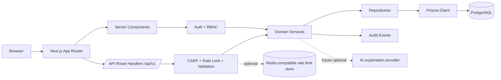

# N5Deal Marketplace Prototype

Production-minded full-stack technical assignment for a private M&A and financial-assets marketplace.

## Project overview

N5Deal is an authenticated marketplace where Buyers discover acquisition opportunities, Sellers manage listings and buyer outreach, and Managers keep the platform trustworthy through moderation and audit visibility. The prototype favors a realistic vertical slice over broad feature sprawl: secure sessions, role-aware workflows, PostgreSQL persistence, deterministic matching, messaging, moderation, and testable service boundaries.

## Product assumptions

- Marketplace data is private and requires authentication.
- Email addresses and phone numbers are not the contact mechanism; users communicate through internal platform conversations.
- Managers can see operational metadata that Buyers and Sellers cannot.
- Smart Matching is deterministic and explainable first. It is not presented as machine learning.
- Production startup must not auto-seed demo data.

## Roles and flows

- Buyer: login, browse `/marketplace`, filter/search/sort, see Smart Match scores, open `/assets/[slug]`, contact Seller, use `/messages`, and maintain `/buyer/profile`.
- Seller: login, create/edit/publish/archive assets in `/seller/assets`, browse safe Buyer profiles in `/buyers`, contact Buyers, and use `/messages`.
- Manager: login, inspect `/manager`, filter users/assets, suspend/restore participants, suspend/restore assets, and review recent audit events.

## Tech stack

- Next.js App Router, React, TypeScript strict mode
- PostgreSQL with Prisma migrations
- Zod validation, React Hook Form
- Server-side sessions with `HttpOnly` cookies
- Vitest unit/integration tests
- Playwright E2E specs
- Tailwind CSS v4 styling

## Architecture



```text
app/                 Server-rendered pages and /api/v1 route handlers
components/          Presentation and isolated interactive forms/actions
server/auth/         Session resolution, role guards, pure permissions
server/repositories/ Prisma data-access and database-side query builders
server/services/     Asset lifecycle, buyer profiles, messaging, moderation, audit, matching
server/security/     CSRF origin checks and rate-limit abstraction
validation/          Shared Zod schemas for query and mutation input
prisma/              PostgreSQL schema, migrations, and deterministic seed data
tests/               Vitest policy tests and Playwright demo flows
```

## Database model

Core entities: `User`, `Session`, `BuyerProfile`, `SellerProfile`, normalized Buyer criteria, `Asset`, `Conversation`, `Message`, and `AuditEvent`.

Indexes cover role/status filters, asset visibility/search filters, conversation participants/update recency, message history, and audit lookups. Foreign keys use restrictive deletes for marketplace records and cascade only where cleanup is appropriate, such as sessions and messages under a conversation.

## Authentication and RBAC

Sessions use random tokens stored only as SHA-256 hashes with `SESSION_SECRET`. Cookies are `HttpOnly`, `SameSite=Lax`, and `Secure` in production. Logout invalidates the server-side session record. Suspended users cannot resolve as current users and are blocked from protected marketplace actions.

RBAC is enforced through server guards. Seller asset mutations are scoped by `seller.userId`; conversation reads/writes require buyer/seller membership; Manager APIs require the Manager role.

## Marketplace querying

Marketplace filters are parsed with Zod and translated into Prisma `where` clauses. The app does not load all assets into the browser for client-side filtering. Pagination uses `skip`/`take` and a count query, with page size capped at 50. URL query state is shareable.

## Asset lifecycle

```text
Seller:  DRAFT -> PUBLISHED -> ARCHIVED
Seller:  ARCHIVED -> DRAFT or PUBLISHED
Seller:  SUSPENDED -> no seller transition
Manager: any seller state -> SUSPENDED -> previousStatus, or DRAFT if unknown
```

Sellers cannot undo manager suspension.

## Smart Matching

Smart Matching is deterministic, centralized in `server/services/match-service.ts`, and returns a `0-100` score, `Strong/Good/Weak` level, reasons, and mismatches.

Weights: category `22`, geography `18`, investment range `22`, revenue range `12`, EBITDA range `12`, deal type `14`.

Example: if an asset is a German FINTECH full acquisition with asking price, revenue, and EBITDA inside the Buyer’s configured ranges, it scores `100%` because all six dimensions match. If geography is outside target markets, it loses the 18 geography points but still explains the other matched dimensions.

Missing optional financial criteria do not penalize the score; they simply do not add points for that dimension. No optional LLM layer is implemented. If added later, the deterministic score should remain the source of truth and only minimal non-sensitive context should be sent server-side.

## Messaging

`Conversation` connects one Buyer and one Seller, optionally around an Asset. Starting contact creates or reuses a thread for the buyer/seller/asset combination. Messages are trimmed, length-limited, plain text only, and reject HTML-like input before storage. Message bodies are not stored in audit metadata.

## Manager moderation and audit

Manager workflows live at `/manager` and use database aggregation for metrics. Mutations create `AuditEvent` records for login, asset lifecycle, moderation, conversation creation, and message sending. Audit events avoid secrets, raw tokens, passwords, and message contents.

## Security decisions

- Auth: bcrypt password hashes, expiring server-side sessions, logout invalidation, secure production cookie flags.
- Authorization: role guards, seller ownership checks, conversation membership checks, Manager-only APIs.
- Input: Zod schemas for auth, filters, assets, buyer profiles, messages, buyer discovery, and moderation.
- CSRF: unsafe session-authenticated methods validate `Origin` or `Referer`; production rejects missing origin signals.
- XSS: React escaping plus message validator rejecting HTML-like payloads; no `dangerouslySetInnerHTML`.
- Rate limiting: login, conversation creation, message sending, and moderation mutations are rate-limited.
- Data leakage: Buyer discovery uses profile-safe DTOs; public asset details sanitize Seller identity; Manager-only views may show operational emails.
- Decimal: money is validated as decimal strings, stored as `DECIMAL(18,2)`, and serialized as fixed strings.

## Rate limiting

Local development uses an in-memory limiter behind `server/security/rate-limit.ts`. `RATE_LIMIT_REDIS_URL` is documented for production, but Redis is not mandatory for local review. Without a distributed provider, rate limits are per application instance and should not be considered production-grade for multi-instance deployments.

## Error handling and observability

API errors return safe `{ error: { code, message, requestId } }` payloads and set `x-request-id`. Unexpected server errors are structured JSON logs through `server/logger.ts`. Auth failures and moderation actions are logged without passwords, raw tokens, secrets, or message bodies. The app includes safe global error and not-found pages.

## Local setup

```bash
cp .env.example .env.local
pnpm install
docker compose up -d
pnpm run db:migrate:deploy
pnpm run db:seed
pnpm dev
```

The included Docker Compose PostgreSQL is only one local option. Any valid PostgreSQL connection can be used by setting `DATABASE_URL`; tests and migrations are not hardcoded to localhost.

## Environment variables

Required:

- `DATABASE_URL`: PostgreSQL connection string
- `SESSION_SECRET`: at least 32 characters
- `APP_URL`: canonical app URL, for example `http://localhost:3000`

Optional:

- `DATABASE_URL_POOLED`: optional pooled PostgreSQL connection string for deployment providers that expose one. The current Prisma datasource uses `DATABASE_URL`; keep migrations on the direct connection unless the deployment architecture is intentionally changed.
- `RATE_LIMIT_REDIS_URL`: future Redis-compatible distributed limiter configuration
- `AI_PROVIDER_API_KEY`: reserved for optional future match explanation summaries
- `MONITORING_DSN`: reserved for optional external monitoring

No server secrets use `NEXT_PUBLIC_`. Keep real values in `.env.local` locally or in the deployment provider environment; `.env.local` must never be committed.

## Deployment

The app is prepared for Vercel plus managed PostgreSQL such as Neon or Supabase-compatible Postgres.

Production deployment:

- URL: https://n5deal-marketplace-blond.vercel.app
- Provider: Vercel project `n5deal-marketplace`
- Database: existing Neon PostgreSQL database
- Required Production env names: `DATABASE_URL`, `DATABASE_URL_POOLED`, `SESSION_SECRET`, `APP_URL`
- Production `APP_URL`: configured to the Vercel production origin above

Recommended deployment flow:

```bash
pnpm install
pnpm run db:generate
pnpm run build
pnpm run db:migrate:deploy
```

Set production `DATABASE_URL`, `SESSION_SECRET`, and `APP_URL` in the hosting provider. `DATABASE_URL_POOLED` is documented for providers such as Neon/Supabase that expose a pooler URL, but the current app keeps Prisma simple and reads `DATABASE_URL` for CLI and runtime. Do not run `pnpm run db:seed` automatically during production startup; seed is for demos and E2E reset only.

## Testing

```bash
pnpm run lint
pnpm run typecheck
pnpm test
pnpm run build
pnpm exec prisma validate
```

Database-backed E2E flow:

```bash
pnpm run db:migrate:deploy
pnpm run db:seed
pnpm run test:e2e
```

For a non-local app URL:

```bash
PLAYWRIGHT_BASE_URL="https://your-preview-url.example" pnpm run test:e2e
```

Playwright runs serially with one worker because Manager moderation tests intentionally mutate shared seeded demo state. The seed script resets demo users, conversations, audit events, buyer criteria, and seeded asset statuses so E2E can be re-run safely.

## Current validation status

Last validation was run on September 1, 2026.

| Check | Status | Notes |
| --- | --- | --- |
| Lint | PASS | Existing ESLintRC deprecation warning only |
| TypeScript | PASS | `tsc --noEmit` |
| Unit/integration tests | PASS | 19/19 Vitest tests |
| Prisma format | PASS | `prisma format --check` |
| Prisma validate | PASS | validated with `.env.local` |
| Production deployment | PASS | Vercel production deployment READY and aliased to https://n5deal-marketplace-blond.vercel.app |
| Production build | PASS | Vercel and local Next.js builds completed; no release-blocking warnings |
| Neon DB connection | PASS | deployed app uses the existing Neon PostgreSQL database |
| DB migrations | PASS | `0001_init` and `0002_phase3_operations` confirmed applied in `_prisma_migrations` |
| Manual Buyer QA | PASS | production login/logout, marketplace filters/search/sort, asset detail, Smart Match, messages, buyer profile, and persistence restore |
| Manual Seller QA | PASS | production login/logout, seller assets, create/edit pages, and Buyer discovery |
| Manual Manager QA | PASS | production dashboard metrics, participant data, asset data, and audit data |
| Security/access QA | PASS | production secure session cookie flags, protected-route redirects, Buyer/Seller/Manager role gates, CSRF origin rejection, and client secret exposure scan |
| Responsive/accessibility QA | PASS | inspected Buyer, Seller, and Manager surfaces at 1440/1024/768/390; no horizontal overflow after manager mobile table fix; keyboard focus starts at skip link |
| Playwright E2E | PASS | 10/10 passed locally against the Neon-backed app |

The production persistence check updated a Buyer profile value, refreshed to confirm Neon persistence, and restored the original value.

## Demo accounts

Demo access is available through the in-app Demo identity buttons on `/login`.

These seeded demo-only credentials are intended for reviewer access and do not grant access to infrastructure, Vercel, Neon, or any real account:

| Role | Email | Password |
| --- | --- | --- |
| Buyer | buyer@n5deal.demo | BuyerDemo2025! |
| Seller | seller@n5deal.demo | SellerDemo2025! |
| Secondary Seller | seller2@n5deal.demo | SellerDemo2025! |
| Manager | manager@n5deal.demo | ManagerDemo2025! |

## AI development disclosure

Codex was used as an implementation assistant for scaffolding, iteration, testing, and review. Architectural decisions, product scope, data-model tradeoffs, and security decisions were explicitly reviewed during implementation. Generated changes were validated with lint, typecheck, unit/integration tests, Prisma validation, and production build checks. The project does not claim autonomous AI authorship.

## Tradeoffs

- The rate limiter abstraction is ready for a distributed store, but the current implementation is local memory unless `RATE_LIMIT_REDIS_URL` is integrated.
- Smart Match sorting ranks a bounded candidate set after database filtering. That is appropriate for the prototype dataset; a production marketplace should move ranking deeper into the data layer or a search index.
- Manager detail drilldowns are intentionally compact; the console exposes lists, metrics, actions, and audit events without creating a new reporting product.
- No realtime chat, notifications, read receipts, or complex analytics were added because Phase 4 explicitly avoids scope expansion.

## What I would improve with more time

- Add distributed rate limiting with Redis/Upstash.
- Add CI that provisions PostgreSQL, runs migrations, seeds, and executes Playwright.
- Add external monitoring, log shipping, and alerting.
- Add richer manager detail pages and audit filters.
- Add optional AI-generated match explanation summaries behind server-only keys.
- Deploy to a preview URL and record final browser QA screenshots.
